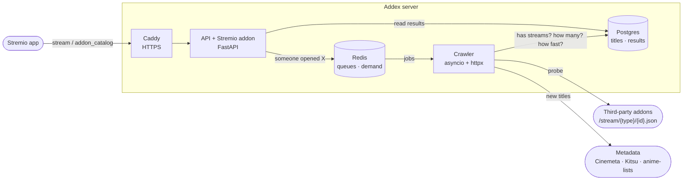

# Addex

**Which Stremio addon has this?** Addex is an open-source index of which
[Stremio](https://www.stremio.com/) addons have streams for each movie, series and anime,
and a Stremio addon that tells you, right in the stream list, which addon to install to
watch what you're looking at.

**Live:** <https://addex.duckdns.org>

Addex never hosts, stores or returns streams. It only records *whether* an addon answers
for a title (and how many streams it lists, and how fast). The streams themselves come
from the addon, after you install it.

## What it does

Stremio's content comes from community addons, and none of them covers everything. Finding
the one that has a given title usually means installing addons one by one. Addex checks
them for you:

- **In the stream list.** Open a movie or an episode and Addex adds one entry per indexed
  addon that has it: *Install TorrentsDB · 50 streams · confirmed 2 h ago*. Clicking it
  opens that addon's install page.
- **In the Addons screen.** Two catalogs, *Addex: most coverage* and *Addex: anime*, list
  the indexed addons ranked by how many of the checked titles they actually have, with
  Stremio's own Install button.
- **Personalised.** Tick the addons you already have (and optionally hide P2P/torrent
  addons) and Addex stops suggesting them. The settings live in your install URL, so there
  are no accounts.
- **Anything you open.** Titles Addex hasn't seen yet are indexed and checked the first
  time someone opens them; reopen a minute later and the results are there.

## Install

Open <https://addex.duckdns.org>, choose your settings and press **Install in Stremio**.
Or paste `https://addex.duckdns.org/manifest.json` into Stremio's addon search.

## How it works



1. A **registry** of addon manifest URLs says which addons to track. Each manifest is
   parsed into the types and ID prefixes the addon accepts, using the same rules as the
   Stremio client, so an addon is only asked about titles it can answer.
2. **Seeds** load the most popular anime (Kitsu, with MAL/AniList IDs) and movies/series
   (Cinemeta, IMDb IDs). Kitsu's per-season anime entries are grouped under their IMDb
   series, so search shows *Attack on Titan* once.
3. The **crawler** asks each addon for streams of each title, with a queue per host, a
   rate limit that backs off when a host answers 429, a circuit breaker for hosts that
   are down, and a refresh interval that depends on popularity.
4. The **API** serves search, title details, and the Stremio addon itself. Each stream
   request also tells the crawler that someone is looking at that title, so it is checked
   ahead of the backlog.

More in **[docs/architecture.md](docs/architecture.md)** (components, request flow, crawler,
data model) and **[docs/stremio-addon.md](docs/stremio-addon.md)** (the addon protocol and
what we learned implementing it).

## Repository

```
packages/core/      shared Python: data model, migrations, manifest parser, registry,
                    seeds, title linking, on-demand notes, `addex` CLI
services/crawler/   scheduler, per-host workers, on-demand loop (`addex-crawler`)
services/api/       FastAPI: JSON API, Stremio addon, install/configure page (`addex-api`)
apps/web/           Next.js front-end (not started)
registry/           curated addon manifest URLs, with the reasons addons were excluded
deploy/             production Docker Compose + Caddy, and a deployment guide
docs/               architecture and addon documentation
```

## Running it locally

Needs Python 3.12 and Docker.

```sh
docker compose up -d                                   # Postgres (port 5433) + Redis
python -m venv .venv && . .venv/Scripts/activate       # or .venv/bin/activate
pip install -e "packages/core[dev]" -e "services/crawler[dev]" -e "services/api[dev]"
cd packages/core && alembic upgrade head && cd ../..

addex registry sync        # registry/addons.yaml -> addons table
addex seed anime           # 500 most popular anime from Kitsu
addex seed imdb            # 500 most popular movies + 500 series from Cinemeta
addex link anime           # group Kitsu entries under their IMDb titles

addex-crawler run          # scheduler + workers + on-demand checks
addex-api                  # http://127.0.0.1:8000 (install page), /docs (API)

pytest                     # DB/Redis tests use addex_test / redis db 15, skipped if down
```

Deploying publicly (Oracle Cloud free tier + DuckDNS + Caddy): **[deploy/README.md](deploy/README.md)**.

## Ground rules

- **No streams, ever.** No URLs, magnets or info hashes are stored or returned. Probes count
  the streams in a response and drop the body; a test fails if a column that could hold a
  link appears in the results table.
- **Polite crawling.** One request per second per host by default, slower when a host asks,
  paused when it's down, identified by its User-Agent.
- **Respect the addon authors.** Addons that require configuration, forbid third-party
  clients, or block server traffic are left out rather than worked around. The reasons are
  recorded in [registry/addons.yaml](registry/addons.yaml).

## Disclaimer

Addex is an index of publicly reachable Stremio addons and of whether they respond for a
title. It does not host, link to or distribute content. What an addon provides, and
whether using it is legal where you live, is between you and that addon.
