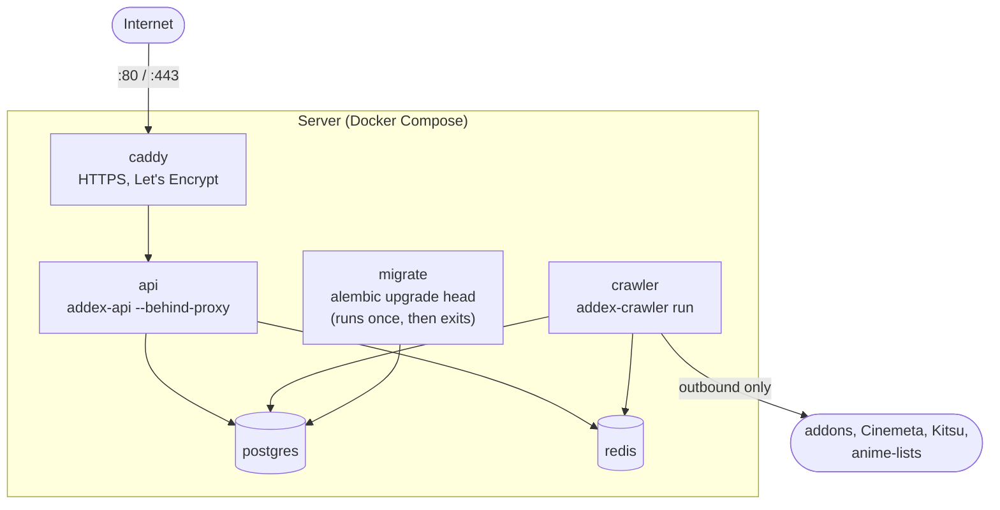
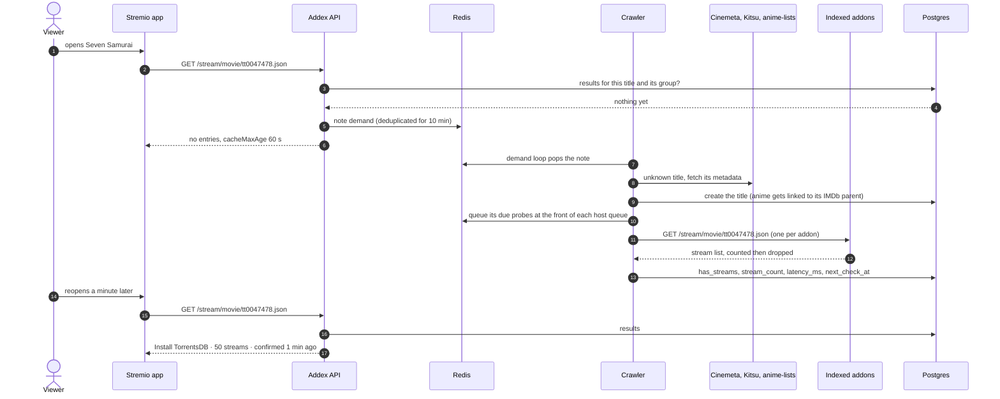
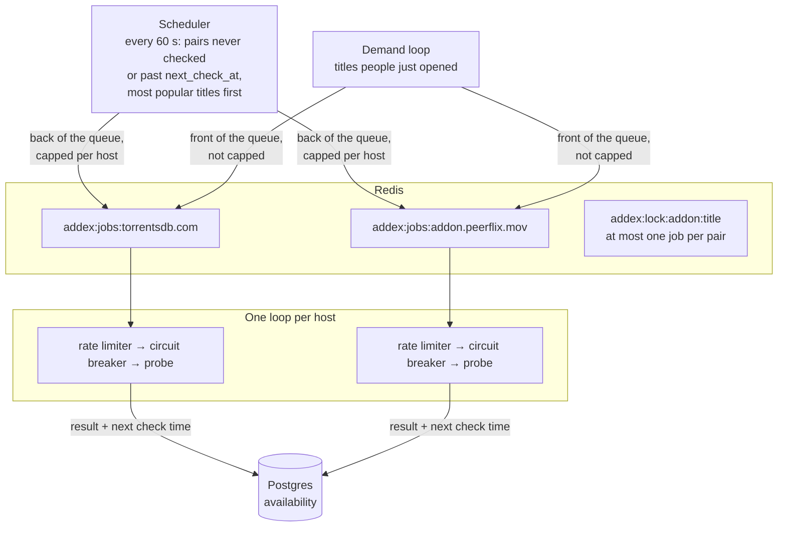
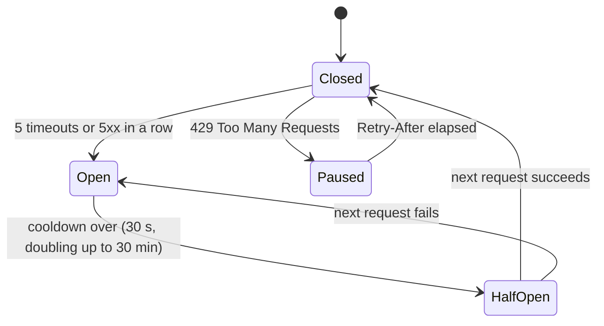
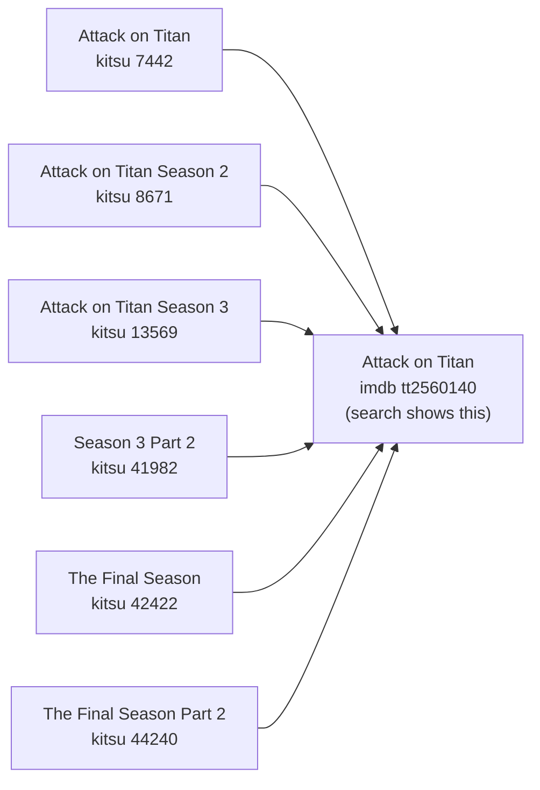
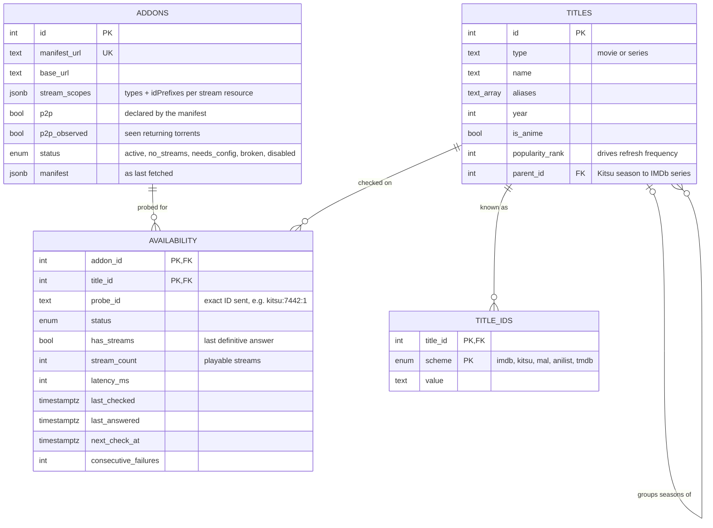

# Architecture

Addex is three Python packages in one repository, backed by Postgres and Redis:

| package | runs as | job |
|---|---|---|
| `packages/core` (`addex_core`) | library + `addex` CLI | data model and migrations, manifest parser, registry sync, title seeds and linking, Stremio ID helpers |
| `services/crawler` (`addex_crawler`) | `addex-crawler run` | decides what to check, probes addons, records results |
| `services/api` (`addex_api`) | `addex-api` | JSON API, the Stremio addon, the install/configure page |

## Deployment

Everything runs from one Docker Compose file on a single server. Only Caddy is reachable
from outside.

`api` and `crawler` start only after `migrate` has finished, so the schema is always
current. Redis snapshots every minute, so queued work survives a restart.

## What happens when someone opens a title

The Stremio addon answers from what is already known and, at the same time, asks the
crawler to check the title. Nothing waits on a third-party addon while the viewer waits.

Safeguards on this path:

- A title opened many times is noted once per 10 minutes.
- New titles are capped at 30 a minute, so made-up IDs can't turn into a flood of lookups.
- IDs that no metadata source knows are remembered for a day.
- Jobs are queued only after the title is committed, so a worker never sees a title that
  isn't in the database yet.
- If Redis is down the API still answers; only the on-demand check is skipped.

## Crawler

**Which ID to probe with.** A title can have several IDs (IMDb, Kitsu, MAL, AniList). For
each addon the scheduler picks the first one the addon accepts, preferring Kitsu for anime
and IMDb otherwise. Series are probed through their first episode (`tt0944947:1:1`,
`kitsu:1376:1`) because addons only answer for episodes.

**One queue per host.** A slow or broken host only delays its own queue. Each host gets:

- a **rate limiter**: one request per second by default. Every `429` doubles the interval
  (up to one a minute); twenty good answers in a row shrink it by 20% again.
- a **circuit breaker** for hosts that are down:

A 404 or a malformed body counts as a bad answer for that title, not as the host being
down.

**What a probe records.** Status (`ok`, `empty`, `timeout`, `http_error`, `invalid`,
`error`), the number of *playable* streams, latency and HTTP status. A stream only counts
if it has a source key (`url`, `infoHash`, `ytId`, `externalUrl`, ...): placeholder entries
such as "configure this addon" are ignored. Whether any stream is a torrent is noted on
the addon (`p2p_observed`), because many torrent addons don't declare it. Only key presence
is checked; the values are never read.

**A failure doesn't erase an answer.** A timeout updates `status` but keeps the last
`has_streams` and `stream_count`, since it says nothing about the title.

**When to check again.**

| title popularity rank | answered | failed |
|---|---|---|
| top 50 | 6 h | 15 min, doubling, up to the answered interval |
| 51 – 200 | 12 h | 〃 |
| 201 – 1000 | 1 day | 〃 |
| unranked | 3 days | 〃 |

## Titles

Seeds come from two sources with different shapes: Kitsu lists anime per season, IMDb
(through Cinemeta) per series. Rather than merging rows, each Kitsu entry points to its
IMDb title through `parent_id`, using the
[Fribb/anime-lists](https://github.com/Fribb/anime-lists) mapping.

So each season keeps being probed with its own Kitsu ID, IMDb-only addons still get the
series, the two seeds never overwrite each other, and search and the addon show one
result with everything aggregated.

Titles opened in Stremio are created from whichever ID the client sends: IMDb through
Cinemeta, Kitsu through Kitsu, and MyAnimeList through its Kitsu entry (anime-lists maps
MAL to Kitsu for about two thirds of MAL entries, which covers the commonly watched ones).
A MAL request therefore lands in the same group as the Kitsu and IMDb entries. Search matches names and aliases (romaji, English,
Japanese) of the parent or any child, with trigram similarity for typos.

## Data model

Migrations live in `packages/core/migrations` (Alembic); `alembic check` confirms they
match the models.

## Registry

[`registry/addons.yaml`](../registry/addons.yaml) is the list of addons Addex tracks.
`addex registry sync` fetches every manifest and sets each addon's status:

- `active`: crawled.
- `no_streams`: catalog/metadata only.
- `needs_config`: the manifest requires configuration.
- `broken`: the manifest can't be fetched; the last good copy is kept.
- `disabled`: removed from the registry. Adding it back re-enables it.

Only `active` addons are ever shown. The file also records why candidates were left out:
some need configuration, one forbids unauthorised clients, and some block datacenter IPs.

## Testing

`pytest` from the repository root runs every package's tests. Database and Redis tests
use a separate `addex_test` database and Redis db 15, wrap each test in a transaction that
is rolled back, and are skipped if the services aren't running. HTTP is mocked with
`httpx.MockTransport`; nothing in the test suite touches the network.
