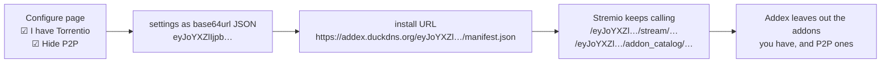

# The Addex Stremio addon

Addex speaks the [Stremio addon protocol](https://github.com/Stremio/stremio-addon-sdk/blob/master/docs/protocol.md)
directly from FastAPI (`services/api/src/addex_api/routes_stremio.py`), without the Node
SDK. The protocol is plain HTTP + JSON; what the SDK adds (configuration, cache headers,
publishing) is reimplemented in a few lines each.

## Routes

| route | what it returns |
|---|---|
| `/manifest.json` | the manifest |
| `/stream/{type}/{id}.json` | one *Install &lt;addon&gt;* entry per indexed addon that has the title |
| `/addon_catalog/all/addex-top.json` | indexed addons ranked by coverage |
| `/addon_catalog/all/addex-anime.json` | the same, by coverage of anime titles |
| `/`, `/configure` | install and configure page |
| `/{config}/...` | every route above, with per-user settings |

## Manifest

```json
{
  "id": "org.addex.index",
  "resources": [
    {"name": "stream", "types": ["movie", "series"], "idPrefixes": ["tt", "kitsu:", "mal:"]},
    "addon_catalog"
  ],
  "types": ["movie", "series"],
  "catalogs": [],
  "addonCatalogs": [
    {"type": "all", "id": "addex-top", "name": "Addex: most coverage"},
    {"type": "all", "id": "addex-anime", "name": "Addex: anime"}
  ],
  "behaviorHints": {"configurable": true},
  "logo": "https://addex.duckdns.org/static/logo.png",
  "background": "https://addex.duckdns.org/static/background.png"
}
```

`contactEmail` (Stremio's *Report* button) is added when `ADDEX_CONTACT_EMAIL` is set.

## Stream entries

Addex never returns a playable source. Each entry is an external link:

```json
{
  "name": "Addex",
  "description": "Install TorrentsDB\n50 streams · P2P · confirmed 2 h ago",
  "externalUrl": "https://web.stremio.com/#/addons?addon=https%3A%2F%2Ftorrentsdb.com%2Fmanifest.json"
}
```

Any season or episode of a series resolves to the whole group: asking for
`kitsu:8671:4` (season 2, episode 4) lists every addon that has any season. Each request
also notes demand, so unknown or stale titles are checked right away (see
[architecture.md](architecture.md#what-happens-when-someone-opens-a-title)).

## Addon catalogs

Stremio's Addons screen lists the addon catalogs of every installed addon. Addex returns
its indexed addons with their own manifests, so they install with Stremio's native
Install button, and prepends its measurements to each description:

> *Addex: streams for 96% of 92 titles checked.* Provides torrent streams from …

Addons are ranked by coverage, except that an addon with fewer than 10 answers ranks after
all the others, so "100% of 2" can't beat "96% of 92".

## Configuration



Stremio calls whatever URL was installed, so settings travel with every request and Addex
keeps no user data. The *Configure* button in Stremio opens `{config}/configure`, which
loads the page with the current settings filled in. An unreadable config segment is a 404
rather than silently ignored.

## Caching

Cache hints go in the body (read by Stremio) and as `Cache-Control` (read by proxies and
browsers), like the official SDK:

| response | max-age | stale-while-revalidate | stale-if-error |
|---|---|---|---|
| streams found | 1 h | 4 h | 7 days |
| no streams yet | 60 s | | |
| addon catalogs | 6 h | 1 day | 7 days |
| manifest | 1 h (header only) | | |

Empty answers are short-lived because they usually mean a check was just queued.

## Lessons learned

Things that cost a debugging session each. All are covered by tests.

**`title` and `description` together make Stremio drop the response.** stremio-core
deserializes `description` with `alias = "title"`. Sending both is a duplicate-field error,
and the client silently discards *all* the streams: the server logs a 200, nothing shows up.
Send `description` only.

**`stremio://` in `externalUrl` doesn't install.** The desktop app hands `externalUrl` to
the system browser, which turns `stremio://host/manifest.json` into
`https://stremio//host/...`. The Stremio Web install page
(`https://web.stremio.com/#/addons?addon=<encoded manifest URL>`) works everywhere; the
`stremio://` link is still the right one on a regular web page.

**Installing from `localhost` needs Private Network Access.** Stremio's UI is a public
https page. Chromium preflights its requests to `127.0.0.1` with
`Access-Control-Request-Private-Network`; Starlette rejects that with a 400 unless
`allow_private_network=True`, and the client reports "Failed to fetch".

**Resource matching has two subtleties.** In stremio-core's `is_resource_supported`, empty
`idPrefixes` accept *every* ID, and a resource declared as an object does *not* inherit
the top-level `types`/`idPrefixes` (no `types` means it is never requested). Addex's
manifest parser mirrors this, so the crawler only asks an addon what Stremio would.

**Addon catalogs are matched by `addonCatalogs`, not `resources`.** The client requests
an addon catalog when its `type` and `id` appear in `addonCatalogs`; the manifest's
`types` and `idPrefixes` play no part, so the catalog type (`all`) doesn't need to be a
content type. Listing `addon_catalog` in `resources` is only for other tools that read it.

**"Installed" means the same transport URL.** The Addons screen shows *Install* for an
addon you already use if you installed a configured variant, since the URL differs. That
is what the *I have it* setting is for.

**Some addons block servers.** Cloudflare answers 403 to datacenter IPs for some addons,
whatever the User-Agent. They work from a home connection but not from the crawler's
server. Addex leaves them out instead of routing around the block (see
[registry/addons.yaml](../registry/addons.yaml)).

## Publishing

`addex publish https://addex.duckdns.org/manifest.json` does what the SDK's
`publishToCentral` does: it asks `api.strem.io` to fetch the manifest and list the addon
among Stremio's community addons. Re-run it after a version bump.
